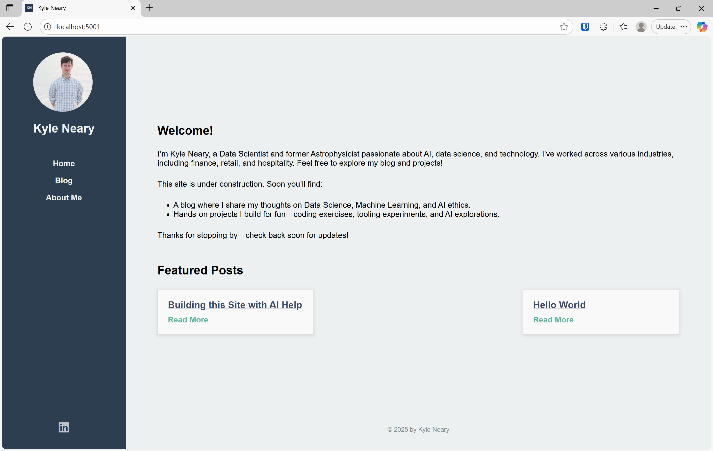
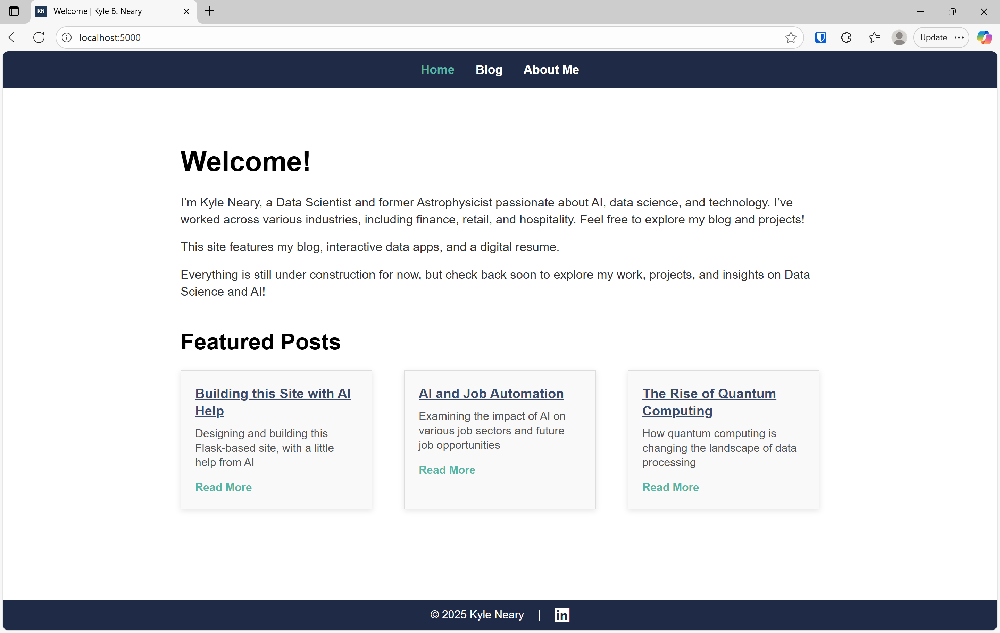

# The Construction of This Site: A Journey from Idea to Code with AI

Building a website can often feel like an overwhelming task, especially when you’re aiming for both functional and visually appealing design. Traditionally, creating a site from scratch can take weeks of planning, designing, coding, testing, and debugging. But with the advancements in AI and modern web development tools, I was able to streamline the process and build a functional, publishable website in under a day.

In this post, I’ll share how I built this site, the thought process behind the design, and how AI-powered tools helped me rapidly generate the code. I’ll also compare this version with the previous one, which used side navigation, and explain how this current design marks a departure from that approach.

## My Previous Version: Side Navigation and Simplicity

Before diving into the current version of the site, it’s important to reflect on the previous design. The earlier version of the site was simple, minimalistic, and functional. It used **side navigation**, which allowed easy access to the blog, resume, and other sections without cluttering the top of the page. The layout was clean, but I quickly realized that I wanted to experiment with something different—something more modern.

While side navigation worked well for the earlier version, it didn’t feel as fluid or dynamic as I wanted for the final site. The decision to switch to **top navigation** was driven by my desire to make the design more intuitive and visually appealing for a larger variety of users. With top navigation, the website layout would feel more open, with content taking up more of the screen space.

---

## The New Design: Embracing Top Navigation and a Fresh Layout

The current version of this website started with the goal of integrating **top navigation**, a more modern approach that places the navigation bar at the top of the page, horizontally. I felt this would be a more user-friendly and clean layout for the site, particularly for showcasing blog posts and my professional resume.

In addition to moving the navigation to the top, I wanted to try a **minimalist aesthetic** with clear content separation. I aimed for a design that felt modern yet simple, with the content neatly organized into distinct blocks, making the site both visually appealing and easy to navigate.

### **Prompting AI for Help**

Building this site quickly was only possible with the help of AI. I was able to describe my design ideas and get detailed code back in seconds, allowing me to build the structure and functionality without getting bogged down in repetitive coding tasks. Here’s how I used AI in various stages of the process:

#### 1. Creating the Basic Framework: ####
   - **Prompt**: "Generate a simple Flask app with top navigation, a blog section that displays featured posts, and a resume page. Use a minimalist design with a white background, dark text, and accent colors."
   - The AI quickly provided the base HTML, CSS, and Python code to create the Flask application. It included a home page, a blog section, and a resume page, with a solid structure for top navigation.

#### 2. Designing the Navigation: ####
   - **Prompt**: "Create a top navigation bar with links to Home, Blog, Projects, and Resume. The navigation should be fixed at the top and the layout should be responsive on mobile devices."
   - This generated a clean navigation bar with CSS styling that made the navigation links prominent, fixed at the top of the page, and easily adjustable for different screen sizes.

#### 3. Building the Blog Section: ####
   - **Prompt**: "Write HTML and JavaScript to display blog posts dynamically from a Python function. Each post should have a title, a short summary, and a 'Read More' link."
   - The AI helped me quickly generate the structure for displaying blog posts as cards, with a dynamic, readable layout.

#### 4. Styling and Debugging: ####
   - **Prompt**: "Write CSS for a minimalist design with clear content blocks. The layout should feature a clean, simple design with lots of white space and clear content separation."
   - The AI provided the CSS for a modern look with minimalist elements. As I encountered small bugs or design issues, I would ask the AI for suggestions. For example, I had issues with the hover effect on the navigation, and AI helped me fix the behavior so that the links were underlined without changing the color.

---

## Debugging and Refining the Design

Even with AI generating most of the code, there were still several adjustments and refinements needed throughout the build. One major decision was **moving the navigation from the side to the top**, which required changes to the layout and CSS to ensure everything looked good on both desktop and mobile screens.

#### 1. Fixing Layout Issues: ####
   - **Problem**: The side navigation, which was present in the previous version, left too much empty space on the page. I wanted to maintain a clean layout without unnecessary gaps.
   - **AI Solution**: I provided the AI with a description of the layout issue, and it helped me switch to a top navigation bar, reducing the excess space on the page.

#### 2. Improving Responsiveness: ####
   - As the design evolved, I needed to make sure the site looked good on all devices. The AI-generated CSS was a great starting point, but I used media queries to refine the mobile view and ensure a responsive layout for different screen sizes.

#### 3. Debugging and Final Tweaks: ####
   - As with any development project, there were some final tweaks that needed to be made—adjusting margins, fixing spacing issues, and ensuring everything was aligned perfectly. Using AI to help with debugging sped up this process significantly, as I could describe the issue and receive solutions almost instantly.

---

## Integrating Elements into the Final Design

While I’m happy with the initial design, I’ve decided that the version I’ve built so far will serve as a **prototype** for the final website. I’ll be **integrating key elements from this design** into a more polished final version. The features I plan to keep include:

- **The top navigation bar**, which I think works better for this layout compared to side navigation.
- **The minimalist design**, with clear content separation and modern aesthetics.
- **The responsive layout** that adjusts to different screen sizes seamlessly.

### Final Version: Going Beyond the Prototype

I will be refining the final design to create something more visually sophisticated. This will involve **enhancing the visual hierarchy**, tweaking the color scheme, and adding more interactive features, such as personalized content recommendations based on user preferences. Additionally, I plan to integrate some new AI-driven features, like interactive data visualizations for blog posts or projects.

---

## The Role of AI in Web Development: A Game-Changer

This project has demonstrated how AI can transform the web development process. Here’s a summary of the benefits of using AI for building websites:

- **Speed**: AI helped me generate working code quickly, cutting development time dramatically. What would have normally taken days or weeks was done in under a day.
- **Iterative Development**: I could iterate on the design easily, generating new code snippets as needed. Each time I wanted to test a new idea, AI generated the necessary changes for me.
- **Debugging**: AI made debugging far more efficient. Instead of spending hours trying to figure out why something wasn’t working, I could just ask the AI for help, and it would provide solutions in real time.

This rapid development process allowed me to focus on the creative aspects of the site—design, content, and user experience—without being bogged down by the technical details.

---

## Conclusion: The Future of Web Development with AI

As I move forward with the final version of this site, I’m excited about the possibilities that AI opens up for web development. By leveraging AI tools, I’ve been able to experiment with new design ideas, iterate quickly, and produce a functional, polished website in no time.

The future of web development is undoubtedly influenced by AI, and I look forward to continuing to experiment with AI-driven tools to build even more advanced, interactive websites in the future.

Stay tuned for the final version of my site, where I’ll be introducing more advanced features, a refined design, and an overall better user experience!

---
